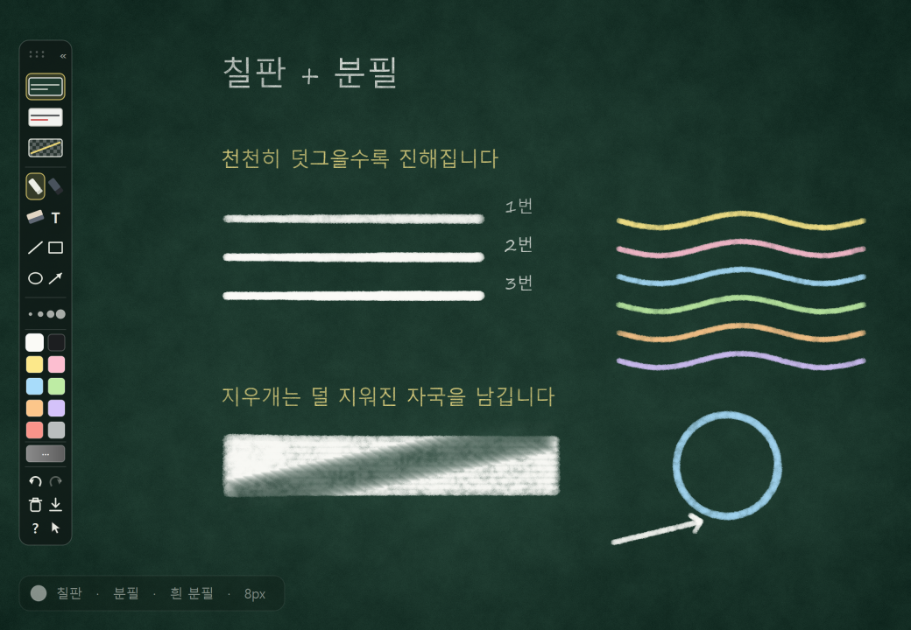
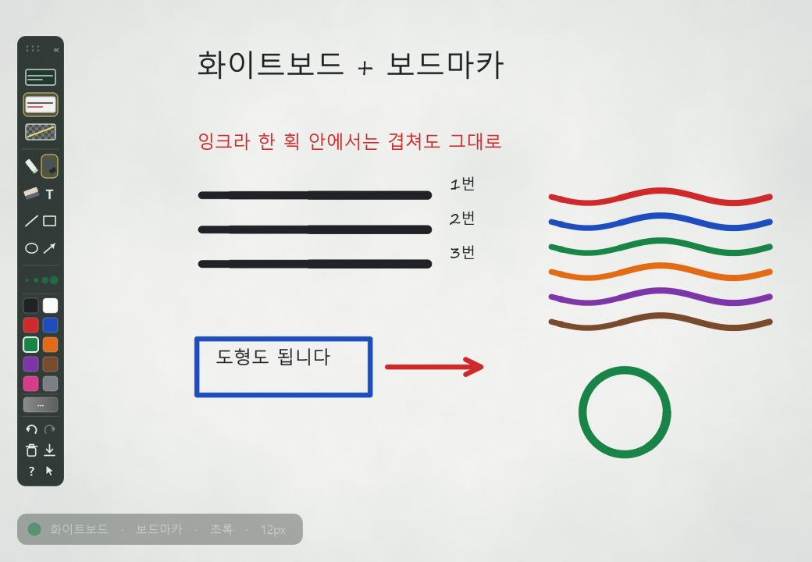
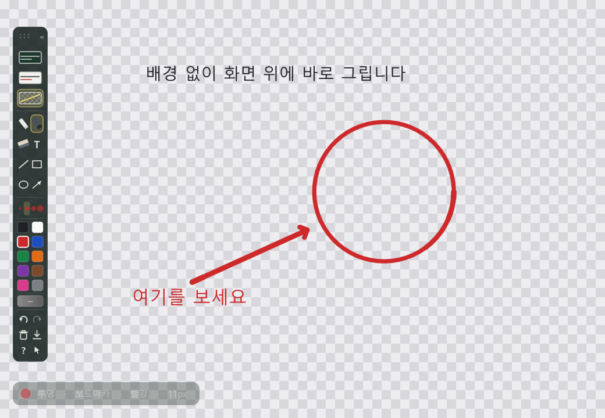
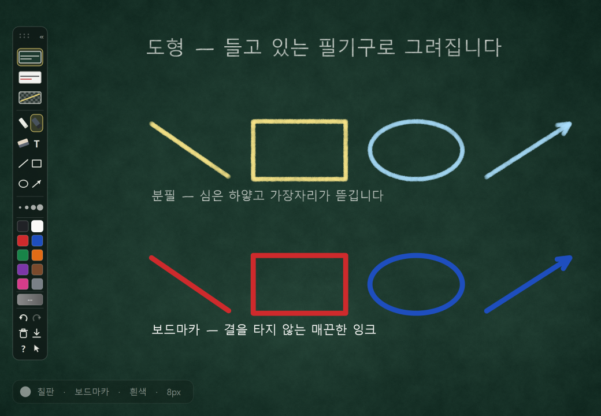
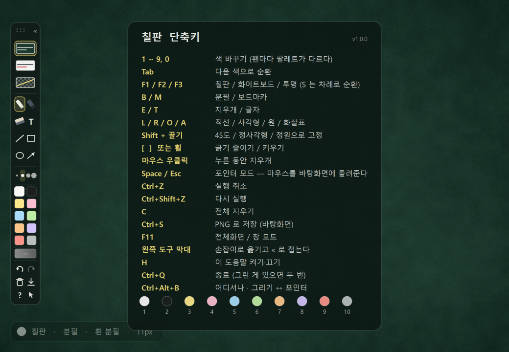

# 칠판 (Chalkboard)

바탕화면 위에 분필과 보드마카로 글을 쓰고 그림을 그리는 윈도우 앱입니다.
질감을 픽셀 단위로 합성해서, 분필은 힘을 빼면 가늘어지며 칠판 결을 타고 끊기고,
세게 누르면 굵고 하얗게 꽉 찹니다.

## 내려받기

### → [최신판 내려받기 (chalkboard-1.2.0.exe)](../../releases/latest)

**설치가 필요 없습니다.** 내려받은 파일을 더블클릭하면 바로 뜹니다.
Python 도, 다른 프로그램도 필요 없습니다.

- 64비트 Windows 10 / 11
- 약 60MB · 실행 파일 하나

> 처음 실행할 때는 내용을 임시 폴더에 푸느라 **창이 뜨기까지 3초쯤** 걸립니다.
> 두 번째부터는 더 빠릅니다.

## 처음 실행할 때 — "Windows의 PC 보호" 경고

내려받아 실행하면 파란 창이 뜨면서 막힐 수 있습니다.

> **Windows의 PC 보호**
> Windows Defender SmartScreen에서 인식할 수 없는 앱의 시작을 차단했습니다.

**"추가 정보" 를 누르면 나타나는 "실행" 단추를 누르면 됩니다.**

이 경고는 바이러스가 발견되었다는 뜻이 아닙니다. **코드 서명 인증서가 없는**
프로그램이라는 뜻입니다. 인증서는 연 수십만 원짜리 유료라 개인이 만든 앱에는
대개 없고, 내려받은 사람이 적을수록 이 경고가 더 잘 뜹니다.

미덥지 않으면 실행하지 마세요. 내려받은 파일을
[VirusTotal](https://www.virustotal.com/) 에 올려 확인해 보셔도 됩니다.

## 무엇을 할 수 있나

### 모니터 여러 대

붙어 있는 **화면 전부를 한 장의 칠판으로 덮습니다.** 모니터 두 대에 걸쳐 선을
그어도 이어집니다. 단축키 표와 상태 표시는 주 모니터 안에만 뜹니다 — 창 한가운데에
두면 두 모니터의 경계선에 반씩 걸쳐 보이기 때문입니다. 도구 막대는 어느 모니터로든
끌어다 둘 수 있습니다.

모니터를 붙였다 떼거나 해상도를 바꾸면 알아서 다시 맞춥니다. 주 화면 하나만 쓰고
싶으면 트레이 메뉴의 **모든 화면에 펼치기** 를 끄면 됩니다 — 설정은 다음 실행에도
남습니다.

### 세 가지 배경 — `F1` / `F2` / `F3`

| 배경 | 키 | |
|---|---|---|
| 칠판 | `F1` | 짙은 녹색 칠판 |
| 화이트보드 | `F2` | 흰 보드 |
| 투명 | `F3` | 배경 없이 **바탕화면 위에 바로** |

그림은 배경을 바꿔도 그대로 남습니다. 칠판에 마커로 쓰거나 화이트보드에 검정
분필로 쓰는 조합도 됩니다 — 배경과 필기구는 서로를 건드리지 않습니다.

### 두 가지 펜 — `B` 분필 / `M` 보드마카

힘을 빼거나 빠르게 그으면 **가늘어지고**, 세게 누르거나 천천히 그으면 굵어집니다.
흐려지는 게 아니라 가늘어집니다 — 실제 분필이 그렇습니다. 대신 약하게 그으면
칠판 결을 타서 획이 끊깁니다.

Wacom 같은 펜 태블릿이 있으면 진짜 필압이 반영되고, 펜을 뒤집으면 지우개가 됩니다.
태블릿이 없어도 마우스를 긋는 속도로 같은 효과가 납니다.

### 도형 — `L` 직선 / `R` 사각형 / `O` 원 / `A` 화살표

끌면 안내선이 따라오고, 손을 떼면 **지금 들고 있는 필기구로** 그려집니다.
분필로 그린 사각형은 분필이고, 마커로 그린 원은 마커입니다.
`Shift` 를 누른 채 끌면 45도 / 정사각형 / 정원으로 고정됩니다.

### 포인터 모드 — 끄지 않고 물러나기

칠판은 화면을 통째로 덮습니다. 잠깐 다른 일을 하려고 앱을 끄면 그려 둔 것이 같이
날아가므로, **마우스만 바탕화면에 돌려주고 앱은 살려 두는** 상태가 따로 있습니다.

`Space` 나 `Esc` 를 누르면 물러납니다. 투명 배경에서는 그림이 화면에 남은 채
클릭만 통과하고, 칠판·화이트보드에서는 창이 사라집니다. **그림은 어느 쪽이든
그대로 있습니다.**

돌아올 때는 **`Ctrl+Alt+D`** — 어디서 무엇을 하고 있든 듣습니다.
작업표시줄의 트레이 아이콘을 눌러도 되고, 바로가기를 다시 눌러도 됩니다
(새 창이 생기는 대신 숨어 있던 칠판이 그림째 돌아옵니다).

> **`Esc` 나 창 닫기로는 종료되지 않습니다.** 트레이에 남아 그림을 붙들고 있습니다.
> 정말 끝내려면 `Ctrl+Q` (그린 게 있으면 두 번) 또는 트레이 메뉴의 `종료` 입니다.

## 단축키

앱을 처음 켜면 이 표가 9초간 떴다가 사라집니다. `H` 로 다시 볼 수 있습니다.

| 키 | 동작 |
|---|---|
| `1` ~ `9`, `0` | 색 바꾸기 (펜마다 팔레트가 다릅니다) |
| `Tab` | 다음 색으로 순환 |
| `F1` / `F2` / `F3` | 배경: 칠판 / 화이트보드 / 투명 |
| `S` | 배경 순환 |
| `B` / `M` | 분필 / 보드마카 |
| `E` / `T` | 지우개 / 글자 (클릭한 자리에 타이핑, 한글 입력 지원) |
| `L` / `R` / `O` / `A` | 직선 / 사각형 / 원 / 화살표 |
| `Shift` + 끌기 | 도형을 45도 / 정사각형 / 정원으로 고정 |
| `[` `]` 또는 마우스 휠 | 굵기 줄이기 / 키우기 |
| 마우스 우클릭 드래그 | 누르고 있는 동안만 지우개 |
| `Space` / `Esc` | 포인터 모드 — 마우스를 바탕화면에 돌려줍니다 |
| **`Ctrl+Alt+D`** | **어디서나** 그리기 ↔ 포인터 |
| `Ctrl+Z` / `Ctrl+Shift+Z` | 실행 취소 / 다시 실행 |
| `C` | 전체 지우기 (`Ctrl+Z` 로 되돌릴 수 있음) |
| `Ctrl+S` | PNG 로 저장 — `바탕화면/칠판/` 폴더 |
| `F11` | 전체화면 / 창 모드 |
| `H` | 이 표 켜기·끄기 |
| `Ctrl+Q` | 종료 (그린 게 있으면 두 번) |

왼쪽 **도구 막대**로도 전부 됩니다. 손잡이를 끌어 옮기고 `«` 로 접을 수 있으며,
자리와 접힘 상태는 다음 실행에도 남습니다.

## 저장

`Ctrl+S` 를 누르면 `바탕화면/칠판/` 폴더에 PNG 로 저장됩니다. 저장은 백그라운드에서
돌기 때문에 화면이 멈추지 않고, 저장되는 동안 계속 그릴 수 있습니다.
투명 배경에서는 배경 없이 알파를 살려 저장하고, 그린 영역만 잘라냅니다.

## 판 기록

판마다 무엇이 달라졌는지는 [릴리스](../../releases) 에 적혀 있습니다.

## 포함된 것과 라이선스

이 저장소는 **배포용**입니다 — 실행 파일과 이 설명서만 있습니다.

실행 파일 안에는 다음이 함께 들어 있습니다.

| | 라이선스 |
|---|---|
| [Qt](https://www.qt.io/) / [PySide6](https://doc.qt.io/qtforpython/) | [LGPL v3](https://www.gnu.org/licenses/lgpl-3.0.html) |
| [NumPy](https://numpy.org/) | [BSD 3-Clause](https://github.com/numpy/numpy/blob/main/LICENSE.txt) |
| [Python](https://www.python.org/) | [PSF License](https://docs.python.org/3/license.html) |

Qt/PySide6 는 LGPL v3 이므로, 원하시면 **Qt 를 직접 교체해 다시 묶을 수 있는
형태**(폴더형 빌드)를 드립니다. [이슈](../../issues)로 요청해 주세요.
